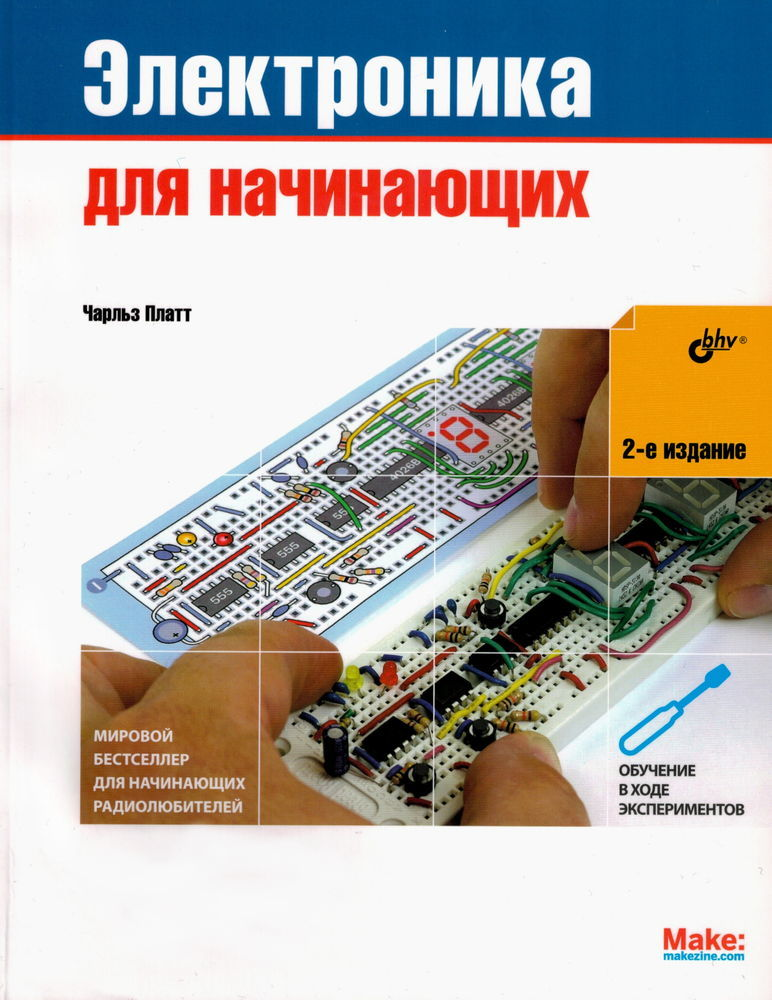
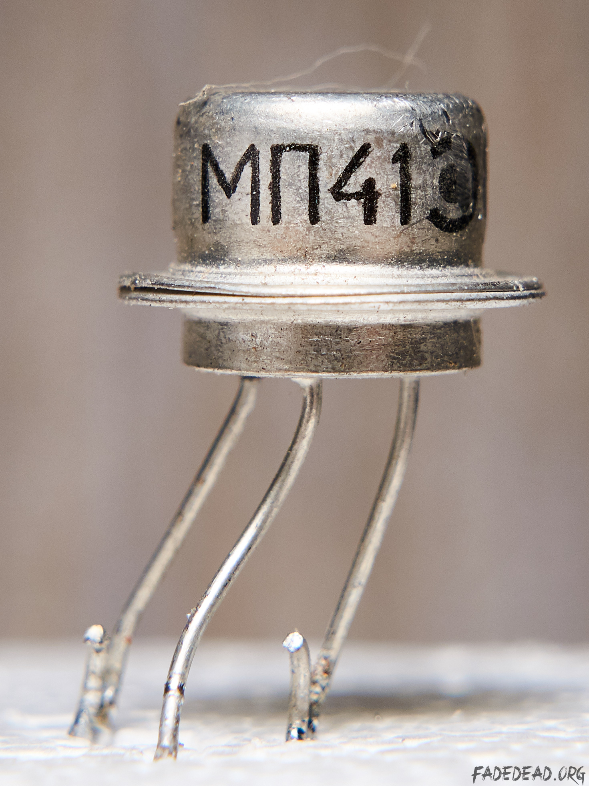
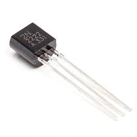
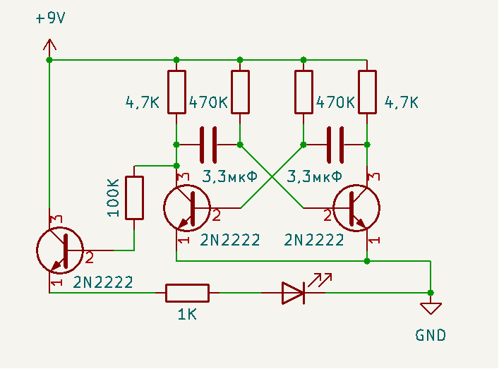

В детстве я был очень любознательным ребёнком. В основном меня интересовал богатый внутренний мир игрушек с моторчиками, радиоприёмников и телевизоров. Для того, чтобы хоть как-то направить мою энергию в мирное русло, меня записали сразу в два кружка районной станции юных техников - авиамоделирования и радиолюбителей. Оба кружка я посещал с большим удовольствием!

В кружке радиолюбителей я наконец-то узнал, как называются, и что важнее, - как работаю и для чего предназначены те разноцветные детальки, которые я добывал как из домашней техники, так и из радиоэлектронного хлама, собранного на ближайших окрестных свалках.

Помню, самым сложным челенджем для меня стала схема мультивибратора. В схеме - ничего сложного. Но, навесной монтаж, непредсказуемый разброс параметров электронных компонентов, порядком меня измотали, пока я добился сначала мигания лампочки, а затем, и звука сирены.

Спустя 40 лет я решил вернуться и начать, конечно же с мультивибратора, но уже на современных компонентах.

## Генератор колебаний

Схему я взял из очень популярной книги "Электроника для начинающих" Чарльза Платта.

Самое существенное отличие от схем, которые я собирал в детстве - это транзисторы. В те далёкие года мультивибраторы собирали в основном, на транзисторах МП41 - самый популярный транзистор в 80 годах 20 века.

Это транзистор относится к германиевым транзисторам с p-n-p структурой.

Сегодня германиевые транзисторы уже нигде не используются. В схеме, которую я взял из книги Платта, применяются уже современные биполярные транзисторы серии 2N2222.

Ну, и о самом ярком впечатлении. Макетная плата - одно из величайших изобретений человечества. С навесным монтажом по удобству использования это даже нельзя сравнивать!

Что во всем этом эксперименте самое удивительное, так это то, что собранный на макетной плате генератор заработал с первого раза! Тут, наверное, сказались впечатления, полученные в детстве при отладке мультивибратора,спаянного навесным монтажом.

## А как же схема?

Написать про собранный своими руками генератор колебаний и не привести его схему, было бы как-то странно. И тут передо мной возник вопрос - как же ее нарисовать? Пришлось изучить и этот вопрос. Выбор соответствующих приложений оказался весьма широк - от бесплатных с открытым исходным кодом, и до коммерческих, стоимостью с небольшую яхту.

Мой выбор остановился на [KiCad](https://www.kicad.org/). Как я понял, это на сегодня лучшее бесплатное решение для подобных задач.

На освоение интерфейса методом научного тыка ушло минут тридцать, если не меньше. В результате получилась вот такая принципиальная схема генератора колебаний:

Понятно, что есть масса нюансов в оформлении принципиальной схемы по всем стандартам, и на производстве за такую поделку мне бы руки оторвали. Но, для первого раза, думаю, пойдёт (при этом в TODO списке появился еще один пунктик - разобраться подробней с KiCad).

## Возможности для импровизации

В схему мультивибратора можно практически бесконечно вносить изменения. Например, если к светодиоду добавить дополнительную резистивно-ёмкостную цепочку, светодиод будет не просто вспыхивать и гаснуть, а мягко пульсировать.

А если заменить конденсатор 3,3 мкФ на пару конденсаторов по 0,33 мкФ, то они будут заряжаться примерно в 10 раз быстрее, и частота мигания светодиода существенно возрастёт.

Ну, а если пойти еще дальше и уменьшить номиналы конденсаторов до 0,01 мкФ, частота колебаний в секунду превысит 50, а это означает переход от колебаний, которые можно увидеть, к колебаниям, которые можно услышать.

## Впечатления

Основное впечатление вынесено в заголовок поста. А еще это интересно и затягивает...
В ближайших планах - дочитать книгу и повторить приведённые в ней эксперименты. Ну а дальше - длинный список идей с различной степенью безумности.

Что еще удивило, так это степень погрешности характеристик электронных компонентов. Я почему-то ожидал значительного прогресса в этом направлении, но...
Например, резистор с цветовой маркировкой, сообщающей о сопротивлении 470 кОм, при измерении мультиметром показывал фактическое значение 490 кОм.
